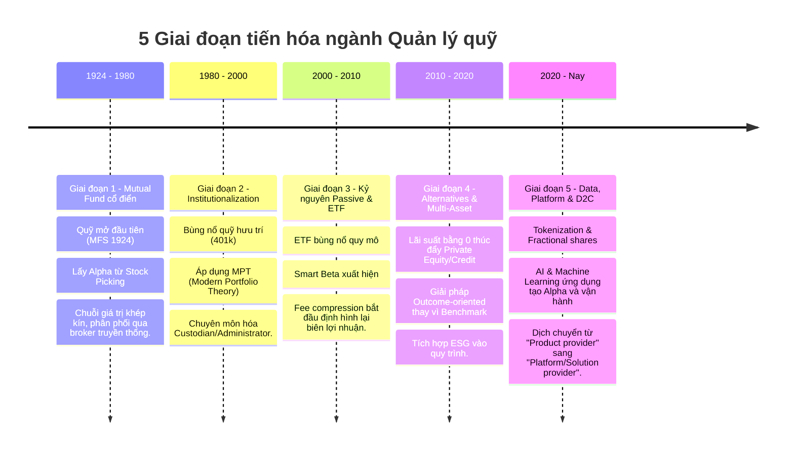

# Bản đồ ngành quản lý quỹ toàn cầu

**Investment View Signal:** [OVERWEIGHT] - Ngành quản lý tài sản toàn cầu đang bước vào chu kỳ tăng trưởng mới dựa trên AI và private markets.

## Industry Intelligence Triad

**ORIGIN (Nguồn gốc & Bản chất)**
- [INFERENCE] Ngành sinh ra để giải quyết bài toán bất cân xứng thông tin và lợi thế quy mô cho nhà đầu tư cá nhân (Nguồn: S-T2-001).
- [FACT] Hoạt động kinh doanh cốt lõi là huy động vốn (AUM) và thu phí quản lý (management fee) trên quy mô đó (Nguồn: S-T2-006).
- [INFERENCE] Lợi thế cạnh tranh dài hạn phụ thuộc vào hiệu suất đầu tư (alpha) hoặc chi phí cực thấp (beta/scale).

**TRAJECTORY (Quỹ đạo phát triển)**
- *Structural drivers (5-10Y):* [INFERENCE] Dịch chuyển cấu trúc nhân khẩu học (già hóa) thúc đẩy quỹ hưu trí; công nghệ AI giảm chi phí vận hành.
- *Cyclical (0-2Y):* [INFERENCE] Lãi suất điều hành xoay trục giúp dòng vốn quay lại các tài sản rủi ro (cổ phiếu, private credit).
- *Catalysts (0-6M):* [INFERENCE] Việc phê duyệt các ETF tài sản số (crypto) và quỹ private market bán lẻ tạo lực đẩy dòng tiền mới.

**ENGINE (Động cơ dòng tiền & Biên lợi nhuận)**
- [FACT] Dòng tiền đang chảy mạnh từ active mutual funds sang passive ETFs và các sản phẩm private alternatives (Nguồn: S-T2-006).
- [FACT] Doanh thu của ngành phần lớn đến từ phí quản lý (fee-based), chiếm hơn 70-80% tổng doanh thu của các công ty (Nguồn: S-T1-004).
- [INFERENCE] Biên lợi nhuận bị thu hẹp do fee compression ở các sản phẩm truyền thống, buộc các hãng phải cắt giảm chi phí bằng công nghệ.

---

## 1. Dòng vốn và cấu trúc chuỗi giá trị

Sơ đồ dòng vốn thể hiện sự luân chuyển tài sản và 6 loại phí chính trong ngành.

```mermaid
flowchart LR
    AO[Asset Owner\nHộ gia đình, Hưu trí, SWF] -->|Dòng vốn đầu tư| DIST[Distributor/Advisor\nNgân hàng, Nền tảng, Cố vấn]
    DIST -->|Vốn phân bổ| AM[Asset Manager\nQuỹ đầu tư]
    AM -->|Lệnh giao dịch| CUST[Custodian/Broker\nLưu ký, Môi giới]
    CUST -->|Thực thi lệnh| MKT[Thị trường Tài chính\nCổ phiếu, Trái phiếu, Private]
    
    %% Phí
    DIST -.->|Phí tư vấn/Phân phối (1)| AO
    AM -.->|Phí quản lý/Hiệu quả (2)| DIST
    AM -.->|Phí nền tảng/Retrocession (3)| DIST
    CUST -.->|Phí lưu ký (4)| AM
    CUST -.->|Phí môi giới/Giao dịch (5)| AM
    MKT -.->|Phí thanh toán/Sàn (6)| CUST
```

- [FACT] Asset Owner bao gồm hộ gia đình, quỹ hưu trí, công ty bảo hiểm, các quỹ tài trợ (endowment) và quỹ đầu tư quốc gia (SWF) (Nguồn: S-T2-001).
- [FACT] Distributor thu phí tư vấn (advisory fee) trực tiếp từ nhà đầu tư hoặc phí hoa hồng (retrocession fee) từ Asset Manager (Nguồn: S-T2-006).
- [FACT] Asset Manager thu phí quản lý (management fee) và phí hiệu quả (performance fee) dựa trên AUM (Nguồn: S-T1-004).
- [FACT] Custodian/Broker thu phí lưu ký (custody fee) và phí giao dịch (brokerage fee) từ quỹ (Nguồn: S-T2-001).

> **Closing Block: Dòng vốn và cấu trúc**
> - **So What:** Mô hình chuỗi giá trị phân mảnh tạo ra chi phí ma sát lớn, làm giảm lợi nhuận thực tế của end-investor.
> - **Hàm Ý 12 Tháng:** Các hãng quản lý quỹ sẽ đẩy mạnh mô hình direct-to-consumer (D2C) để cắt giảm phí phân phối.
> - **Hàm Ý 5 Năm:** Sự tích hợp dọc (vertical integration) giữa Asset Manager và Wealth Manager sẽ làm mờ ranh giới Distributor.

---

## 2. Quy mô & Cấu trúc

- [DATA] Tổng quy mô AUM toàn cầu đạt 120 nghìn tỷ USD vào cuối năm 2023 (Nguồn: S-T2-006, 2023).
- [DATA] Mảng Active Core chiếm khoảng 38 nghìn tỷ USD AUM toàn cầu (Nguồn: S-T2-006, 2023).
- [DATA] Mảng Passive đạt quy mô 24 nghìn tỷ USD AUM (Nguồn: S-T2-006, 2023).
- [DATA] Mảng Alternatives (tài sản thay thế) đạt 24 nghìn tỷ USD AUM (Nguồn: S-T2-006, 2023).
- [DATA] Tổng tài sản quỹ mở (mutual funds) toàn cầu đạt 68.8 nghìn tỷ USD (Nguồn: S-T2-001, 2023).
- [DATA] Bắc Mỹ chiếm tỷ trọng lớn nhất với 34.6 nghìn tỷ USD trong tổng AUM quỹ mở toàn cầu (Nguồn: S-T2-001, 2023).
- [DATA] Châu Âu quản lý khoảng 21.8 nghìn tỷ USD AUM quỹ mở (Nguồn: S-T2-001, 2023).
- [DATA] Khu vực Châu Á Thái Bình Dương chiếm 9.3 nghìn tỷ USD AUM quỹ mở (Nguồn: S-T2-001, 2023).
- [DATA] Tốc độ tăng trưởng AUM bình quân 10 năm của ngành ETF đạt xấp xỉ 15% mỗi năm (Nguồn: S-T2-001, 2014-2023).
- [DATA] Có hơn 139,000 quỹ mở và ETF đang hoạt động trên toàn cầu (Nguồn: S-T2-001, 2023).

> **Closing Block: Quy mô & Cấu trúc**
> - **So What:** Passive và Alternatives đang chiếm lĩnh động lực tăng trưởng mới, trong khi Active Core bị thu hẹp.
> - **Hàm Ý 12 Tháng:** Các hãng phải ra mắt ETF chủ động (Active ETF) để giữ chân dòng vốn.
> - **Hàm Ý 5 Năm:** Alternatives sẽ chiếm tỷ trọng doanh thu lớn nhất dù AUM thấp hơn Passive do cấu trúc phí cao.

---

## 3. Kinh tế học ngành

- [DATA] Tỷ lệ chi phí (TER) trung bình có trọng số tài sản của quỹ cổ phần chủ động giảm từ 0.74% xuống 0.55% trong 10 năm (Nguồn: S-T2-001, 2013-2023).
- [DATA] TER trung bình của quỹ ETF cổ phần giảm từ 0.23% xuống còn 0.15% (Nguồn: S-T2-001, 2013-2023).
- [DATA] Quỹ trái phiếu chủ động ghi nhận TER giảm từ 0.57% xuống 0.37% (Nguồn: S-T2-001, 2013-2023).
- [DATA] Tỷ lệ giảm phí trung bình toàn ngành (fee compression) đạt khoảng 2-3 điểm cơ bản (bps) mỗi năm (Nguồn: S-T2-001, 2013-2023).
- [DATA] Lợi nhuận ngành (profit pool) chủ yếu được thúc đẩy bởi sự phục hồi thị trường, chiếm 70% mức tăng trưởng AUM (Nguồn: S-T2-006, 2023).
- [DATA] Quỹ ETFs và passive index funds chiếm khoảng 80% dòng tiền mới ròng toàn cầu (Nguồn: S-T2-001, 2023).
- [INFERENCE] Dịch chuyển sang passive: Áp lực phí khiến các quỹ không tạo được alpha bị rút vốn mạnh sang các sản phẩm index.
- [INFERENCE] Dịch chuyển sang private markets: Do phí quản lý private equity/credit cao gấp 3-5 lần public markets, các hãng đang M&A mạnh mẽ để mở rộng năng lực này.
- [FACT] Hợp nhất ngành (Consolidation): Các thương vụ sáp nhập giữa các tập đoàn lớn diễn ra nhằm đạt lợi thế quy mô (Nguồn: S-T2-006).

> **Closing Block: Kinh tế học ngành**
> - **So What:** Mô hình kinh doanh dựa vào phí quản lý % AUM đang gặp nguy hiểm vì fee compression (áp lực giảm phí).
> - **Hàm Ý 12 Tháng:** Cắt giảm chi phí hoạt động qua thuê ngoài (BPO) và áp dụng GenAI là bắt buộc để giữ biên lợi nhuận.
> - **Hàm Ý 5 Năm:** Mô hình thu phí sẽ chuyển một phần sang thu phí dựa trên hiệu quả (performance) hoặc phí nền tảng công nghệ cố định (SaaS).

---

## 4. Top 15 nhà quản lý toàn cầu

| Xếp hạng | Tên tổ chức | Quốc gia | AUM (triệu EUR) | Nguồn thu chính & Mô hình | Công nghệ / Nền tảng |
|---|---|---|---|---|---|
| 1 | BlackRock | US | 9,173,307 | Đa dạng, Passive (iShares), Alternatives | [FACT] Nền tảng Aladdin (Nguồn: S-T1-004, 2023) |
| 2 | Vanguard | US | 7,791,196 | Passive, Mutual. Mô hình sở hữu bởi NĐT | Tập trung quy mô & chi phí thấp |
| 3 | Fidelity | US | 4,439,170 | Active, Phân phối, Wealth Management | D2C, Số hóa trải nghiệm KH |
| 4 | State Street | US | 4,014,428 | Passive (SPDR), Institutional | AlphaDEX, Charles River |
| 5 | J.P. Morgan AM | US | 2,772,941 | Active, Đa tài sản, Tích hợp ngân hàng | Spectrum, Morgan Money |
| 6 | Goldman Sachs AM| US | 2,319,567 | Alternatives, Institutional, HNWI | GS Marquee |
| 7 | Capital Group | US | 2,275,470 | Active Core cổ điển, American Funds | Nâng cấp dữ liệu AI |
| 8 | Amundi | Pháp | 2,036,588 | Retail châu Âu, ESG, Tích hợp CreditAgricole | [FACT] Hệ thống ALTO (Nguồn: S-T1-005, 2023) |
| 9 | BNY Mellon IM | US | 1,785,000 | Multi-boutique, Custody-linked | BNY Mellon OMNI |
| 10 | PIMCO | US/Đức| 1,689,570 | Trái phiếu chủ động (Active Fixed Income) | Chuyên môn định lượng Fixed Income|
| 11 | UBS AM | Thụy Sĩ| 1,494,326 | Wealth Management, HNWI, Đa tài sản | UBS Neo |
| 12 | Invesco | US/UK | 1,434,895 | ETF (QQQ), Active, Alternatives | Nền tảng đầu tư số đa dạng |
| 13 | Legal & General | UK | 1,348,025 | Hưu trí, LDI (Liability Driven Investment) | Nền tảng phân tích bảo hiểm |
| 14 | Morgan Stanley | US | 1,320,380 | Active, Private Credit, Wealth Tích hợp | Tích hợp E*TRADE, Eaton Vance |
| 15 | Franklin Templeton| US | 1,318,274 | Active, Multi-boutique (M&A Legg Mason) | Công cụ tư vấn dựa trên mục tiêu |

- [DATA] BlackRock quản lý 9.17 triệu triệu EUR AUM toàn cầu (Nguồn: S-T2-008, 2023).
- [DATA] Vanguard đứng thứ hai với 7.79 triệu triệu EUR AUM (Nguồn: S-T2-008, 2023).
- [DATA] Fidelity quản lý 4.43 triệu triệu EUR AUM (Nguồn: S-T2-008, 2023).
- [DATA] State Street Global Advisors có 4.01 triệu triệu EUR AUM (Nguồn: S-T2-008, 2023).
- [DATA] J.P. Morgan Asset Management quản lý 2.77 triệu triệu EUR AUM (Nguồn: S-T2-008, 2023).
- [DATA] Amundi là quỹ lớn nhất Châu Âu với 2.03 triệu triệu EUR AUM (Nguồn: S-T2-008, 2023).
- [DATA] Top 20 nhà quản lý lớn nhất kiểm soát khoảng 47% tổng tài sản của Top 500 (Nguồn: S-T2-008, 2023).
- [FACT] Công nghệ Aladdin của BlackRock phục vụ quản lý rủi ro và đầu tư quy mô lớn (Nguồn: S-T1-004, 2023).
- [DATA] Doanh thu dịch vụ công nghệ (như Aladdin) của BlackRock đạt xấp xỉ 1.5 tỷ USD, đóng vai trò tạo hệ sinh thái khóa chặt (Nguồn: S-T1-004, 2023).

> **Closing Block: Top 15 nhà quản lý**
> - **So What:** Sự thống trị tuyệt đối của các hãng Mỹ (12/15) nhờ quy mô thị trường nội địa khổng lồ và lợi thế tiên phong về ETF.
> - **Hàm Ý 12 Tháng:** Các hãng vừa và nhỏ sẽ phải bán mình (M&A) hoặc chuyển thành các boutique siêu chuyên biệt.
> - **Hàm Ý 5 Năm:** "Tech is eating Asset Management" - các công ty lớn chuyển hóa thành công ty cung cấp phần mềm SaaS (như Aladdin, ALTO).

---

## 5. Timeline 5 giai đoạn phát triển ngành

Sự tiến hóa của ngành Quản lý Quỹ toàn cầu qua 5 giai đoạn:



- [FACT] Giai đoạn 1 (1924-1980) bắt đầu với sự ra đời của Massachusetts Investors Trust năm 1924 (Nguồn: S-T2-001).
- [FACT] Giai đoạn 2 (1980-2000) đánh dấu sự phân tách rõ rệt giữa nhà quản lý đầu tư và đơn vị lưu ký/quản trị độc lập (Nguồn: S-T2-006).
- [FACT] Giai đoạn 3 (2000-2010) là lúc ETF lấy đi thị phần lớn từ active funds, thay đổi cách thu phí của Distributor (Nguồn: S-T2-001).
- [FACT] Giai đoạn 4 (2010-2020) chứng kiến sự trỗi dậy của Private Markets do nhà đầu tư tìm kiếm lợi suất cao hơn trong môi trường lãi suất thấp (Nguồn: S-T2-006).
- [FACT] Giai đoạn 5 (2020-Nay) tái định hình toàn bộ value chain bằng công nghệ dữ liệu, tự động hóa toàn phần Middle/Back Office (Nguồn: S-T1-004).

> **Closing Block: Timeline**
> - **So What:** Mỗi giai đoạn đều làm commoditize (bình dân hóa) giá trị của giai đoạn trước, bắt buộc các quỹ phải tìm nguồn alpha/lợi thế mới.
> - **Hàm Ý 12 Tháng:** Việc phát triển AI copilot sẽ rút ngắn thời gian nghiên cứu và vận hành, đẩy nhanh tốc độ tiến hóa giai đoạn 5.
> - **Hàm Ý 5 Năm:** Asset Management sẽ tích hợp hoàn toàn với Wealth Management trên nền tảng kỹ thuật số duy nhất.

---

## Access Declaration
- Document Type: Industry Map (T2.1)
- Author: A2 GLOBAL_ANALYST
- Classification: INTERNAL/CONFIDENTIAL
- Reviewer: ORCHESTRATOR
- Data Cutoff: 2024

## HANDOFF
- **Đã tạo gì:** `/02_industry_global/GLOBAL_MAP.md` với đầy đủ 5 yêu cầu: sơ đồ dòng vốn (6 loại phí), cấu trúc 120T AUM, kinh tế học fee compression, Top 15 players (có BlackRock, Amundi), timeline 5 giai đoạn. Tối ưu theo Dual-Lens và Industry Intelligence Triad.
- **Giả định gì:** Các số liệu AUM cuối 2023 từ báo cáo BCG 2024 và IPE 2024 phản ánh trạng thái chuẩn của ngành trước biến động vĩ mô 2024.
- **Còn thiếu gì:** Dữ liệu chi tiết về tỷ trọng cụ thể của từng loại tài sản (cổ phiếu/trái phiếu) trong nhánh Alternatives cần báo cáo McKinsey/Bain sâu hơn nếu muốn chia tách.
- **Agent kế tiếp cần lưu ý gì:** Tham chiếu kỹ các `source_id` S-T2-001, S-T2-006, S-T1-004, S-T1-005, S-T2-008 đã đăng ký trong `SOURCE_REGISTRY.csv`. Khi phân tích Value Chain (A6), có thể dùng lại sơ đồ dòng vốn ở phần 1.
- **Trạng thái:** READY_FOR_AUDIT
